```mermaid
flowchart TD
    %% ==================== 消息入口 ====================
    USER["用户发送消息<br/>自然语言问题 / 确认 / 修改参数"]

    subgraph ENTRY["消息入口：真实企业微信 / 聊天调试台"]
        direction LR

        WECOM["真实企业微信<br/>Codelix 平台助手"]
        DEBUG["聊天调试台<br/>wecom-debug-chat.tsx<br/>send()"]

        WECOM -->|"HTTP POST<br/>/api/agent/wecom/callback"| P_ROUTE_WECOM["Platform Router<br/>wch.Receive"]
        DEBUG -->|"apiFetch POST<br/>/api/me/wecom-chat"| P_ROUTE_DEBUG["Platform Router<br/>wdc.Chat"]
    end

    USER --> WECOM
    USER --> DEBUG

    %% ==================== 真实企微入口 ====================
    subgraph REAL_ENTRY["真实企业微信进入 Platform 后的第一段"]
        direction TB

        P_ROUTE_WECOM --> RECEIVE["WecomCallbackHandler.Receive()"]
        RECEIVE --> ENVELOPE["ParseServiceEnvelope()<br/>解析企微外层报文"]
        ENVELOPE --> CRYPTO["resolveCrypto()<br/>根据 ServiceID 找回调配置"]
        CRYPTO --> DECRYPT["crypto.DecryptMsg()<br/>验签 + 解密"]
        DECRYPT --> CALLBACK["ParseServiceCallback()<br/>解析明文消息"]
        CALLBACK --> RECORD["record()<br/>消息落库 + MsgID 去重"]
        RECORD --> ACK["立即向企业微信返回 HTTP 200"]
        RECORD -->|"首次收到 fresh=true<br/>启动独立 goroutine"| DISPATCH["go dispatch(cb)"]
        DISPATCH --> ONMESSAGE["onMessage(cb)"]
        ONMESSAGE --> HANDLEMSG["handleMessage(cb)<br/>文本类型检查<br/>群聊 @ 检查<br/>特殊事件路由"]
        HANDLEMSG --> BRIDGE_HANDLE["newWecomBridge(...).Handle()"]
        BRIDGE_HANDLE --> RTX["resolveRTX()<br/>企微 UserID → Codelix loginName"]
    end

    %% ==================== 调试台入口 ====================
    subgraph DEBUG_ENTRY["聊天调试台进入 Platform 后的第一段"]
        direction TB

        P_ROUTE_DEBUG --> CHAT["WecomDebugChatHandler.Chat()"]
        CHAT --> LOGIN["currentDebugLogin()<br/>从登录态取得 loginName"]
        LOGIN --> BODY["解析 content / scene"]
        BODY --> HISTORY["保存调试台对话历史"]
        HISTORY --> DEBUG_SSE["建立 text/event-stream<br/>准备向浏览器返回 SSE"]
        DEBUG_SSE --> GATE["检查群聊模拟场景<br/>未 @ 则直接忽略"]
        GATE --> DEBUG_BRIDGE["newWecomBridge(db, registry, nil)<br/>不配置真实企微发送客户端"]
    end

    %% ==================== 共同分叉点 ====================
    RTX --> PREPARE
    DEBUG_BRIDGE --> PREPARE

    subgraph PLATFORM_FLOW["Platform 会话状态机：两条链路在这里分开"]
        direction TB

        PREPARE["newWecomConversationFlow(db)<br/>.prepareMessage(ctx, login, content)"]

        PREPARE --> DEV_PREP["优先调用 prepareDevMessage()<br/>查询当前用户活动研发流程"]
        DEV_PREP --> DEV_DB["读取 wecom_dev_flows<br/>wecom_dev_flow_steps"]
        DEV_DB --> INTENT["识别消息语义<br/>确认 / 否定 / 修改参数 / 回答澄清问题"]

        INTENT --> PREP_RESULT["返回 wecomFlowPreparation<br/>Prompt<br/>DirectReply<br/>Handled<br/>FreshAgent<br/>Run"]

        PREP_RESULT --> SPLIT{"真正的链路分叉点<br/>检查 preparation 结果"}
    end

    %% ==================== Platform 直接处理 ====================
    SPLIT -->|"Handled=true<br/>并且 Run=nil"| DIRECT["Platform 已经完整处理<br/>不启动任何 Agent"]

    DIRECT --> DIRECT_CASES["典型情况：<br/>① 第一次回复“确认”<br/>② 展示规划/任务/编码默认参数<br/>③ 询问修改哪个参数<br/>④ 流程执行中，返回进度提示<br/>⑤ 用户取消流程"]

    DIRECT_CASES --> DIRECT_REPLY["DirectReply"]
    DIRECT_REPLY --> REAL_DIRECT["真实企微：replyPlain()"]
    DIRECT_REPLY --> DEBUG_DIRECT["调试台：SSE text + done"]

    %% ==================== 通用自然语言链路 ====================
    SPLIT -->|"Run=nil<br/>且未被 Platform 完整处理"| NORMAL_START["通用自然语言链路<br/>Prompt 可能是用户原话<br/>也可能被 Platform 重写"]

    subgraph NORMAL_PLATFORM["通用链路：Platform → Agent Server"]
        direction TB

        NORMAL_START --> TARGET1["wecomBridge.resolveLoginTarget()"]
        TARGET1 --> TARGET1_DETAIL["查询用户通知偏好<br/>用户绑定机器<br/>机器是否在线<br/>AgentID / AgentSpec<br/>Claude 或 Codex 引擎<br/>模型 ModelID<br/>API 权限档位"]

        TARGET1_DETAIL --> SESSION["resolveSession()<br/>取得 sessionId 和 resume"]
        SESSION --> FRESH{"FreshAgent=true?"}
        FRESH -->|"是"| NEW_SESSION["freshSession()<br/>创建干净的新会话<br/>resume=false"]
        FRESH -->|"否"| KEEP_SESSION["沿用原 sessionId<br/>支持多轮上下文"]

        NEW_SESSION --> RUN_MACHINE
        KEEP_SESSION --> RUN_MACHINE

        RUN_MACHINE["wecomBridge.runOnMachine()"]
        RUN_MACHINE --> RUN_BODY["构造请求体：<br/>agentId=wecom-assistant 或用户配置 Agent<br/>prompt<br/>sessionId / resume<br/>acpAgentKey<br/>modelId<br/>apiTier<br/>agentSpec"]
        RUN_BODY -->|"HTTP POST<br/>target.BaseURL/api/agents/run<br/>X-User-LoginName"| AGENT_RUN_ROUTE
    end

    subgraph NORMAL_AGENT_SERVER["通用链路：Agent Server /api/agents/run"]
        direction TB

        AGENT_RUN_ROUTE["Agent Server Router<br/>POST /api/agents/run"]
        AGENT_RUN_ROUTE --> AGENTS_RUN["AgentsHandler.Run()"]

        AGENTS_RUN --> DECODE_RUN["解析 agentId / prompt<br/>sessionId / resume<br/>引擎 / 模型 / API 档位"]
        DECODE_RUN --> LOAD_AGENT["ResolveAgentConfig()<br/>加载 wecom-assistant 配置<br/>或自定义 AgentSpec"]
        LOAD_AGENT --> LOAD_PROMPT["取得 Agent system prompt<br/>例如 wecom-assistant/system-prompt.md"]

        LOAD_PROMPT --> CWD["resolveAgentCWD()"]
        CWD --> DETACHED{"是否有 workspaceId<br/>或 serviceId 对应目录?"}
        DETACHED -->|"没有工作区"| AGENT_HOME["resolveDetachedAgentHome()<br/>为企微助手创建独立运行目录"]
        AGENT_HOME --> SKILL_PLAN["detachedAgentSkillPlan()<br/>生成 Skill 物化计划"]
        DETACHED -->|"有工作区"| WS_CWD["使用工作区代码仓库目录"]

        SKILL_PLAN --> RUNTIME
        WS_CWD --> RUNTIME

        RUNTIME["解析运行配置<br/>startMode=CLI/ACP<br/>acpAgentKey=Claude/Codex<br/>modelId"]
        RUNTIME --> RUN_OPTIONS["构造 agents.RunOptions<br/>Prompt / SystemPrompt<br/>CWD / SkillPlan<br/>MCP / CodelixTools<br/>Session / Env"]

        RUN_OPTIONS --> TOKEN{"Agent 是否使用<br/>codelix_api?"}
        TOKEN -->|"是"| ISSUE_TOKEN["runauth.Issue()<br/>签发本次运行 Token<br/>档位 read-only/safe-write/full"]
        TOKEN -->|"否"| START_MODE
        ISSUE_TOKEN --> START_MODE

        START_MODE{"startMode"}
        START_MODE -->|"CLI，wecom-assistant 通常走这里"| RUN_CLI["agents.RunCLI()"]
        START_MODE -->|"ACP"| RUN_ACP["agents.RunACP()"]
    end

    %% ==================== Claude/Codex 运行 ====================
    subgraph MODEL_RUNTIME["底层 Claude / Codex 运行过程"]
        direction TB

        RUN_CLI --> USER_PROMPT["准备用户 Prompt<br/>Prompt + AppendContext"]
        RUN_ACP --> USER_PROMPT

        USER_PROMPT --> SYSTEM_PROMPT["readSystemPrompt()<br/>加载 Agent 角色提示词"]
        SYSTEM_PROMPT --> MATERIALIZE["EnsureClaudeSkillsLinkWithExclude()<br/>将 codelix-console 等 Skill<br/>物化到运行目录"]
        MATERIALIZE --> MCP_CONFIG["buildMCPConfig()<br/>注入 codelix_api 等 MCP Server"]
        MCP_CONFIG --> PROCESS["启动底层进程<br/>Claude CLI / Codex app-server / ACP"]

        PROCESS --> MODEL["Claude / Codex 大模型<br/>收到：<br/>用户自然语言<br/>Agent system prompt<br/>Skill 说明<br/>MCP 工具定义"]

        MODEL --> DECIDE{"模型自主判断<br/>是否需要调用工具"}
        DECIDE -->|"普通问答"| MODEL_TEXT["直接生成自然语言回答"]
        DECIDE -->|"需要操作 Codelix"| READ_SKILL["读取 codelix-console Skill<br/>理解应该调用哪个 API"]
        READ_SKILL --> MCP_CALL["调用 mcp__codelix_api__request"]
        MCP_CALL --> LOCAL_API["codelix_api MCP<br/>携带 Run Token<br/>请求本机 Agent Server API"]
        LOCAL_API --> BUSINESS_API["工作区 / TAPD / TODO<br/>Artifacts / Questions<br/>Services 等业务接口"]
        BUSINESS_API --> API_RESULT["API 返回结构化结果"]
        API_RESULT --> MODEL_RESULT["结果经 MCP 返回 Claude/Codex"]
        MODEL_RESULT --> MODEL_TEXT
    end

    %% ==================== 通用链路返回 ====================
    subgraph NORMAL_RETURN["通用自然语言链路返回"]
        direction TB

        MODEL_TEXT --> RUN_EVENTS["产生 RunEvent<br/>text / done / error"]
        RUN_EVENTS --> AGENT_SSE["AgentsHandler.Run()<br/>转换为 SSE"]
        AGENT_SSE -->|"HTTP SSE 响应"| PLATFORM_SCANNER["runOnMachine()<br/>Scanner 持续读取 data: 事件"]

        PLATFORM_SCANNER --> RETURN_SPLIT{"消息来自哪里?"}
        RETURN_SPLIT -->|"真实企业微信"| STREAM_WECOM["streamToWecom()<br/>把增量事件拼成完整内容<br/>持续更新企微流式消息"]
        RETURN_SPLIT -->|"聊天调试台"| STREAM_DEBUG["WecomDebugChatHandler.Chat()<br/>把事件继续写入浏览器 SSE"]

        STREAM_WECOM --> WECOM_RESULT["用户在企业微信看到回复"]
        STREAM_DEBUG --> DEBUG_RESULT["wecom-debug-chat.tsx<br/>读取 res.body<br/>更新聊天界面"]
    end

    %% ==================== 固定流程确认链路 ====================
    SPLIT -->|"Run != nil<br/>已得到最终确认"| FIXED_START["固定流程确认链路<br/>不再运行 wecom-assistant"]

    subgraph FIXED_PLATFORM["固定流程：Platform 派发"]
        direction TB

        FIXED_START --> RESERVE["prepareDevMessage()<br/>reserveDevRun()<br/>生成 runId<br/>状态改为 dispatching"]
        RESERVE --> RUN_REQUEST["构造 wecomFlowRunRequest：<br/>runId / flowId<br/>workspaceId / step<br/>params / agentRole / prompt"]

        RUN_REQUEST --> TARGET2["resolveLoginTarget()<br/>定位用户绑定且在线的 Agent 机器"]
        TARGET2 --> PERMISSION{"step=coding<br/>且 apiTier 不是 full?"}
        PERMISSION -->|"是"| DENIED["恢复参数确认状态<br/>提示用户打开 full 权限"]
        PERMISSION -->|"否"| START_FLOW["startFlowRunOnMachine()"]

        START_FLOW -->|"HTTP POST<br/>/api/wecom-flow-runs"| FLOW_ROUTE
    end

    subgraph FIXED_AGENT_ENTRY["固定流程：Agent Server 接单"]
        direction TB

        FLOW_ROUTE["Agent Server Router<br/>POST /api/wecom-flow-runs"]
        FLOW_ROUTE --> FLOW_START["WecomFlowRunHandler.Start()"]

        FLOW_START --> VALIDATE["校验 runId / workspaceId / step<br/>校验工作区存在<br/>校验工作区 owner"]
        VALIDATE --> BUILD_PLAN["buildDispatchPlan()"]

        BUILD_PLAN --> STEP{"当前固定环节 step"}
        STEP -->|"planning"| PLANNING_AGENT["选择 requirementAnalyst<br/>标准模式：需求分析 Agent<br/>deep 模式：可追加 solutionDesigner"]
        STEP -->|"tasks"| TASK_AGENT["选择 taskPlanner<br/>通常为 task-planner"]
        STEP -->|"coding"| CODER_AGENT["选择 coder<br/>根据可执行 TODO 构造编码计划"]

        PLANNING_AGENT --> DISPATCH_PLAN["生成结构化 Dispatch Plan<br/>Prompt 由固定流程代码生成<br/>不是用户的“确认”原话"]
        TASK_AGENT --> DISPATCH_PLAN
        CODER_AGENT --> DISPATCH_PLAN

        DISPATCH_PLAN --> ASYNC["go runPlan(context.Background())"]
        ASYNC --> ACCEPTED["立即返回 HTTP 202 Accepted<br/>只表示 Agent Server 已接单"]
        ACCEPTED --> ACCEPTED_REPLY["Platform markDevRunAccepted()<br/>回复：任务后台执行<br/>完成后主动通知"]
    end

    %% ==================== 固定流程工作区执行 ====================
    subgraph FIXED_WORKSPACE_RUN["固定流程：复用工作区 Agent 调度主链"]
        direction TB

        ASYNC --> RUN_PLAN["WecomFlowRunHandler.runPlan()"]
        RUN_PLAN --> POST_PROMPT["dispatcher.PostPromptWithOptions()"]
        POST_PROMPT --> WS_POST["WsChannelHandler.postPrompt()"]

        WS_POST --> SESSION_STATE{"该工作区、该 Agent<br/>当前会话状态"}
        SESSION_STATE -->|"正在运行"| QUEUE["PostModeQueued<br/>加入 pendingPrompts 队列"]
        SESSION_STATE -->|"已有 idle 会话"| REUSE["resumeAgent()<br/>复用已有会话"]
        SESSION_STATE -->|"没有会话"| NEW_AGENT["runAgent()<br/>创建新工作区 Agent 会话"]

        QUEUE --> EXEC_AGENT
        REUSE --> EXEC_AGENT
        NEW_AGENT --> EXEC_AGENT

        EXEC_AGENT["WsChannelHandler.runAgent()"]
        EXEC_AGENT --> EFFECTIVE_AGENT["解析工作区实际 Agent 配置<br/>角色替换 / 编排组绑定<br/>requirement-analyst<br/>task-planner / coder"]
        EFFECTIVE_AGENT --> WORKSPACE_CWD["解析工作区 CWD<br/>关联仓库 / 分支 / TAPD 需求"]
        WORKSPACE_CWD --> FIXED_PROMPT["加载专业 Agent system prompt<br/>物化工作区 Skill<br/>构建 MCP / 工具 / 环境变量"]
        FIXED_PROMPT --> FIXED_RUNTIME["agents.RunCLI() 或 RunACP()"]
        FIXED_RUNTIME --> FIXED_MODEL["Claude / Codex 执行专业 Agent<br/>读取需求、代码、TODO、产物<br/>调用 MCP/API 并写入结果"]
    end

    %% ==================== 固定流程完成回调 ====================
    subgraph FIXED_CALLBACK["固定流程：异步完成、状态推进与主动提醒"]
        direction TB

        FIXED_MODEL --> EVENT_CALLBACK["PromptCallbacks.OnEvent()<br/>收集 Agent 输出<br/>捕获 error / done"]
        EVENT_CALLBACK --> DONE_CALLBACK["PromptCallbacks.OnDone()"]

        DONE_CALLBACK --> FLOW_RESULT["flowRunResult()<br/>读取工作区执行结果：<br/>规划产物 / TODO / 问题<br/>可执行 TODO 数量等"]

        FLOW_RESULT --> RESULT_CHECK{"执行结果"}
        RESULT_CHECK -->|"需要澄清"| WAIT_QUESTION["waiting_questions<br/>暂停流程，等待用户回答"]
        RESULT_CHECK -->|"失败或任务未生成 TODO"| FLOW_FAILED["failed<br/>不进入下一环节"]
        RESULT_CHECK -->|"成功"| REPORT["reportCallback()"]

        WAIT_QUESTION --> REPORT
        FLOW_FAILED --> REPORT

        REPORT -->|"POST Platform<br/>/internal/wecom/flow-run-complete<br/>X-Agent-Token"| COMPLETE_ROUTE["Platform Router<br/>AgentTokenAuth"]
        COMPLETE_ROUTE --> COMPLETE["WecomFlowRunHandler.Complete()"]

        COMPLETE --> OWNER["校验 runId / step<br/>校验回调机器属于该用户"]
        OWNER --> COMPLETE_DB["completeDevRun()<br/>使用 runId 幂等更新数据库"]

        COMPLETE_DB --> NEXT{"当前环节是否成功<br/>并且存在下一环节?"}
        NEXT -->|"需要澄清"| SAVE_WAIT["流程状态 waiting_questions"]
        NEXT -->|"失败"| SAVE_FAILED["流程状态 failed"]
        NEXT -->|"成功且有下一环节"| NEXT_STEP["nextWecomDevStep()<br/>planning → tasks → coding"]
        NEXT -->|"coding 已完成"| FLOW_DONE["整个研发流程 completed"]

        NEXT_STEP --> CREATE_STEP["创建下一环节记录<br/>status=waiting_entry_confirmation"]
        CREATE_STEP --> NEXT_CONFIRM["等待用户再次回复“确认”<br/>进入下一环节参数预览"]

        SAVE_WAIT --> NOTIFY
        SAVE_FAILED --> NOTIFY
        CREATE_STEP --> NOTIFY
        FLOW_DONE --> NOTIFY

        NOTIFY["NotifyFlowCompletion()<br/>生成统一完成消息"]
        NOTIFY --> PUBLISH_DEBUG["publishDebug()<br/>发布聊天调试台主动提醒"]
        NOTIFY --> DELIVER_WECOM["deliver()<br/>发送真实企业微信主动提醒"]

        PUBLISH_DEBUG --> NOTIFY_SSE["调试台持续订阅<br/>GET /api/me/wecom-chat/notifications"]
        NOTIFY_SSE --> DEBUG_PROACTIVE["前端新增 proactive Turn<br/>显示环节完成结果和下一步提示"]
        DELIVER_WECOM --> WECOM_PROACTIVE["真实企业微信收到<br/>环节完成结果和下一步提示"]
    end

    classDef split fill:#ffd6d6,stroke:#d63031,stroke-width:3px,color:#222;
    classDef normal fill:#e8f4ff,stroke:#2980b9,stroke-width:2px,color:#222;
    classDef fixed fill:#fff3d6,stroke:#d68910,stroke-width:2px,color:#222;
    classDef direct fill:#e8f8ef,stroke:#27ae60,stroke-width:2px,color:#222;
    classDef callback fill:#f3e8ff,stroke:#8e44ad,stroke-width:2px,color:#222;

    class SPLIT split;
    class NORMAL_START,RUN_MACHINE,AGENTS_RUN,RUN_CLI,RUN_ACP,MODEL normal;
    class FIXED_START,START_FLOW,FLOW_START,BUILD_PLAN,RUN_PLAN,EXEC_AGENT,FIXED_MODEL fixed;
    class DIRECT,DIRECT_REPLY direct;
    class REPORT,COMPLETE,COMPLETE_DB,NOTIFY callback;
```

```
用户自然语言
“帮我创建一个需求单”
        │
        ▼
企业微信回调 / 聊天调试台
        │
        ▼
Platform Server runOnmachine()//这个是关键函数，发送/api/agents/run到找到的绑定的机器上     runOnMachine在    platform-server/internal/api/wecom_agent_bridge.go下
- 识别当前用户
- 找到用户绑定的 Agent 机器
- 确定 agentId、模型、API 权限
- 不解析“创建需求单”这个业务意图
        │
        │ POST /api/agents/run
        │ {
        │   "agentId": "wecom-assistant",
        │   "prompt": "帮我创建一个需求单",
        │   ...
        │ }
        ▼
目标机器 Agent Server
- 加载 wecom-assistant 配置 //根据agentId"找到代码中wecom-assistant的config配置
- 准备 system prompt
- 物化 codelix-console skill
- 注入 MCP 配置和 API 凭证
        │
        ▼
启动 Claude/Codex
        │
        ├─ 用户消息：帮我创建一个需求单
        ├─ 系统提示词：你是企微助手，动手前读 codelix-console
        ├─ Skill：Codelix API 的接口说明和调用配方
        └─ MCP 工具：mcp__codelix_api__request
        │
        ▼
大模型理解用户意图
- 判断用户要创建需求
- 读取建单操作说明
- 判断信息是否完整
- 不完整则追问
- 完整则决定调用 API
        │
        ▼
调用 MCP 工具
mcp__codelix_api__request({
  method: "POST",
  path: "/api/tapd/tech-story",
  body: {...}
})
        │
        ▼
MCP codelix_api Server
        │ HTTP + X-Codelix-Run-Token
        ▼
目标机器本地 Agent Server
POST /api/tapd/tech-story
        │
        ▼
TechStoryCreate()
        │
        ▼
调用 TAPD stories_create
        │
        ▼
TAPD 返回创建结果
        │
        ▼
结果作为 tool_result 返回 Claude/Codex
        │
        ▼
Claude/Codex 生成自然语言回复
“需求已经创建，需求编号是……”
        │
        ▼
Agent Server 转成 SSE
        │
        ▼
Platform Server 流式转发
        │
        ├─ 正式环境：返回企业微信
        └─ 调试环境：返回聊天调试台
```



